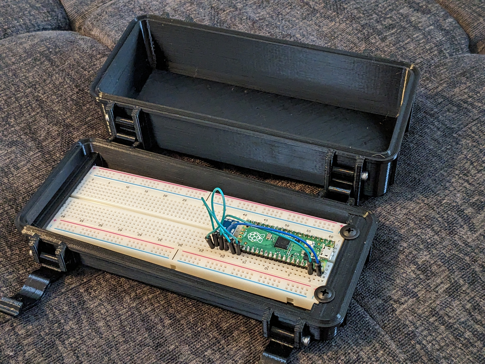
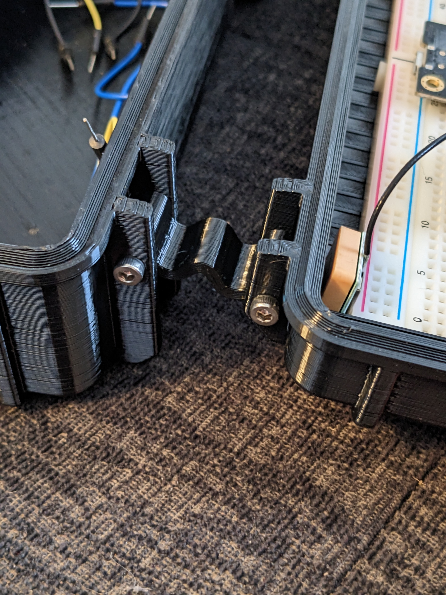

# Workbench: Creating a Container for the Pico and Modules

Remixed off the Frog Box by Nibb31: https://www.thingiverse.com/thing:4094861  

We adjusted the size for our needs and added the ability to hold a breadboard in the lid for safe storage of the student project and parts.

## Parts

Assembly: 
* (8) x M3 x 20mm screws 

Breadboard Attachment:
* (2) x 3mm washers
* (2) x M3 x 20mm screws

or

* (2) x M3 x 10mm - 20mm flanged head screws 

The truss head screws have a larger flange making them the best option, but the other options will work.

## Box

Using the available source files located in [Raspberry Pi Pico Workbench](https://github.com/StratoLab/telemetry/tree/main/raspberry-pi-pico/python/workbench/src)...

Print one each of:  
* Frog Box Lid Pico Screw.stl
* Frog Box no seal.stl

Print two each of:
* hinge_looser.stl
* latch_arm_v2.stl
* latch_cam_v2.stl

Assemble as shown. Simply snug tighten each screw, do not overtighten or it'll strip out the plastic and no longer hold. Ensure the pico usb connection is on the end shown, so it can be plugged in when the box is open. 

Orient the cam so the longer side is away from the other part of the box. 

Orientation of the Latch Arm.

Orientation of the hinge.

